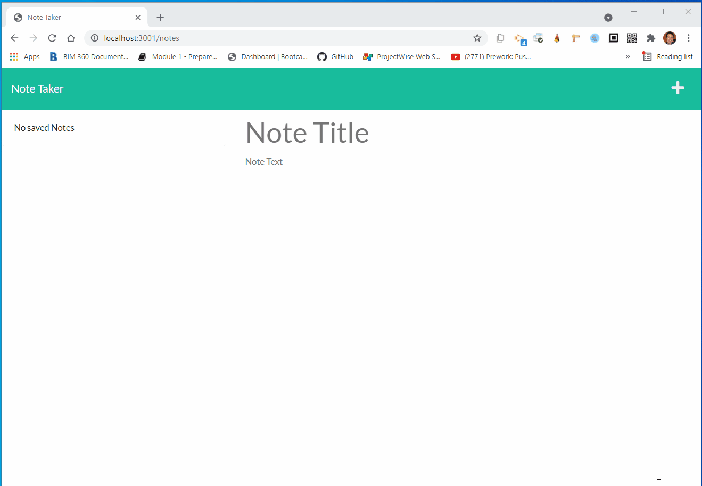

# Note Taker with Express.js

<h2>Table of Contents</h2>

- [Description](#description)
- [Installation](#installation)
- [Usage](#usage)
- [License](#license)
- [Contributing](#contributing)
- [Follow](#follow)

----

## Description

This application uses an [Express.js](https://www.npmjs.com/package/express) back end to save and retrieve note data from a JSON file. This app is also live on [ Heroku]() .

The following animation shows the Note Taker appearance and functionality:

----

## Installation

💾     

`npm install`

----

## Usage

💻   
  
Run the following command at the root of your project

`node server.js` 

Open your browser and type `http://localhost:3001/` to run this application on your local machine.

----

## License

This App is covered by the \

----

## Contributing

Fork this repository if you want to contribute\

----

## Follow
\

